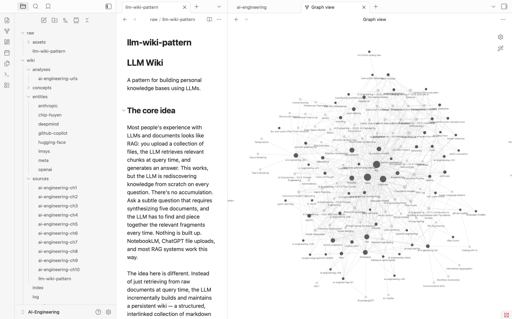

# AI Engineering Wiki

A personal knowledge base (second brain) built from **AI Engineering** by Chip Huyen (O'Reilly, 2025). Maintained by an LLM agent following a structured schema — every page is generated and kept in sync by Claude.

---

## What's Inside

This wiki covers the full stack of building production AI applications, from foundation model internals to deployment architecture. It is organized as an [Obsidian](https://obsidian.md) vault with wikilinks, backlinks, and graph view.

```
.
├── README.md              ← You are here
├── CLAUDE.md              ← Schema & operating manual (governs LLM behavior)
├── raw/                   ← Source documents (immutable)
│   └── assets/
│       └── ai-engineering.pdf
└── wiki/                  ← LLM-generated knowledge base
    ├── index.md           ← Master catalog of all pages
    ├── overview.md        ← High-level synthesis of the entire wiki
    ├── log.md             ← Chronological record of all operations
    ├── sources/           ← One summary page per book chapter
    ├── entities/          ← People, orgs, tools, projects
    ├── concepts/          ← Ideas, frameworks, theories
    └── analyses/          ← Query results, comparisons, reference tables
```

---

## Coverage

All 10 chapters of *AI Engineering* have been ingested:

| Chapter | Topics |
|---|---|
| **Ch.1 — Introduction** | Use case taxonomy, AI engineering vs ML engineering, the three-layer stack |
| **Ch.2 — Foundation Models** | Transformer architecture, attention, scaling laws, post-training (SFT/RLHF/DPO), sampling, hallucination |
| **Ch.3 — Evaluation Methodology** | Perplexity, exact eval (BLEU/ROUGE/pass@k), embeddings, AI-as-a-judge, comparative evaluation (Chatbot Arena) |
| **Ch.4 — Evaluate AI Systems** | Evaluation criteria, factual consistency, safety evaluation, instruction following, model selection, eval pipeline |
| **Ch.5 — Prompt Engineering** | In-context learning, chain-of-thought, prompt decomposition, jailbreaking, defensive prompt engineering |
| **Ch.6 — RAG and Agents** | RAG architecture, vector search (HNSW/IVF/PQ), hybrid search, agents, planning (ReAct/Reflexion), memory |
| **Ch.7 — Fine-Tuning** | When to finetune, SFT/RLHF/DPO, memory math, LoRA, QLoRA, quantization, model merging |
| **Ch.8 — Dataset Engineering** | Data quality criteria, data flywheel, AI-powered synthesis (Alpaca, UltraChat), model distillation, model collapse |
| **Ch.9 — Inference Optimization** | Prefill/decode, KV cache, speculative decoding, FlashAttention, continuous batching, prompt caching, parallelism |
| **Ch.10 — AI Engineering Architecture** | Progressive architecture, guardrails, router/gateway, caching, observability, drift detection |

---

## Key Concepts

The wiki contains **49 concept pages** spanning the major themes:

**Adaptation** · [Model Adaptation](wiki/concepts/model-adaptation.md) · [Prompt Engineering](wiki/concepts/prompt-engineering.md) · [RAG](wiki/concepts/rag.md) · [Finetuning](wiki/concepts/finetuning.md) · [LoRA](wiki/concepts/lora.md) · [Quantization](wiki/concepts/quantization.md) · [Model Merging](wiki/concepts/model-merging.md)

**Evaluation** · [Hallucination](wiki/concepts/hallucination.md) · [Factual Consistency](wiki/concepts/factual-consistency.md) · [AI as a Judge](wiki/concepts/ai-as-a-judge.md) · [Evaluation Pipeline](wiki/concepts/evaluation-pipeline.md) · [Safety Evaluation](wiki/concepts/safety-evaluation.md)

**Data** · [Dataset Engineering](wiki/concepts/dataset-engineering.md) · [Data Synthesis](wiki/concepts/data-synthesis.md) · [Embeddings](wiki/concepts/embeddings.md)

**Systems** · [Agents](wiki/concepts/agents.md) · [Agent Planning](wiki/concepts/agent-planning.md) · [Memory](wiki/concepts/memory.md) · [Inference Optimization](wiki/concepts/inference-optimization.md) · [AI Engineering Architecture](wiki/concepts/ai-engineering-architecture.md)

**Models** · [Transformer Architecture](wiki/concepts/transformer-architecture.md) · [Attention Mechanism](wiki/concepts/attention-mechanism.md) · [Sampling](wiki/concepts/sampling.md) · [Post-Training](wiki/concepts/post-training.md)

---

## Reference Table

[`wiki/analyses/ai-engineering-urls.md`](wiki/analyses/ai-engineering-urls.md) contains all **880 unique hyperlinks** embedded in the book, organized by chapter with anchor text and context. Also available as a CSV: [`wiki/analyses/ai-engineering-urls.csv`](wiki/analyses/ai-engineering-urls.csv).

---

## Setting Up in Obsidian

Obsidian is the recommended way to explore this wiki — it renders wikilinks, shows a live knowledge graph, and tracks backlinks between pages.


*The full knowledge graph of this wiki in Obsidian — each node is a concept, entity, or source page; edges are [[wikilinks]] between them.*

**Step 1 — Install Obsidian**
Download and install [Obsidian](https://obsidian.md) (free, available for Mac, Windows, Linux, iOS, Android).

**Step 2 — Clone this repo**
```bash
git clone https://github.com/moinuddinmusbik/ai-engineering-wiki.git
```

**Step 3 — Open as a vault**
1. Launch Obsidian
2. On the welcome screen click **"Open folder as vault"**
3. Navigate to and select the cloned `ai-engineering-wiki` folder
4. Click **Open**

**Step 4 — Enable recommended plugins (optional but powerful)**

In Obsidian → Settings → Core plugins, make sure these are on:
- **Graph view** — visualizes connections between all 49+ concept pages
- **Backlinks** — shows every page that links to the one you're reading
- **Outgoing links** — shows all links from the current page
- **Search** — full-text search across all wiki pages
- **Tags** — filter pages by topic tag

**Step 5 — Explore**

| What to do | How |
|---|---|
| See the full knowledge graph | Click the graph icon in the left sidebar (or `Ctrl/Cmd + G`) |
| Start reading | Open `wiki/overview.md` for a narrative tour of the whole wiki |
| Browse all pages | Open `wiki/index.md` for the master catalog |
| Follow a concept | Click any `[[wikilink]]` to jump to that concept page |
| Find related pages | Open the Backlinks panel on the right sidebar |
| Filter by topic | Open the Tags panel and click any tag (e.g. `#rag`, `#finetuning`) |

> **Tip:** In graph view, zoom in and hover over nodes to see page names. Clusters of densely connected nodes reveal the core themes of the wiki.

---

## Build Your Own Wiki

This wiki was built using the **LLM Wiki pattern** — an idea by [Andrej Karpathy](https://gist.github.com/karpathy/442a6bf555914893e9891c11519de94f) where an LLM agent builds and maintains your entire knowledge base from source documents.

> 📎 **Original concept:** [Andrej Karpathy's LLM Wiki gist](https://gist.github.com/karpathy/442a6bf555914893e9891c11519de94f)

### What you need
- [Claude Code](https://claude.ai/claude-code) (or any LLM agent — OpenAI Codex, Gemini, etc.)
- [Obsidian](https://obsidian.md) (free) — for viewing the result
- A folder of source documents (PDFs, articles, notes — anything you want to learn from)

### Step 1 — Create your project folder
```bash
mkdir my-wiki && cd my-wiki
mkdir raw          # your source documents go here
```

### Step 2 — Add your sources
Drop any documents you want to build a wiki from into the `raw/` folder — PDFs, markdown files, text files, saved articles.

### Step 3 — Open Claude Code and paste this prompt

Start Claude Code in your project folder, then give it this message:

```
I want to build a personal knowledge base (second brain) using the LLM Wiki 
pattern created by Andrej Karpathy (https://gist.github.com/karpathy/442a6bf555914893e9891c11519de94f).

My wiki will be about: [DESCRIBE YOUR TOPIC — e.g. "machine learning papers I'm reading", 
"my startup's product domain", "philosophy books I'm studying"]

My sources are in the raw/ folder: [LIST YOUR FILES]

Please:
1. Read Karpathy's original gist to understand the pattern
2. Ask me any clarifying questions about my goals for this wiki
3. Create a CLAUDE.md schema file tailored to my topic and source material
4. Once I approve the schema, begin ingesting my first source document

The wiki should use Obsidian-compatible markdown with [[wikilinks]], YAML 
frontmatter, and be organized into: wiki/sources/, wiki/concepts/, wiki/entities/, 
wiki/analyses/, with wiki/index.md and wiki/overview.md as navigation hubs.
```

### Step 4 — Iterate
Once your schema is set, use these commands to grow the wiki:

| Command to Claude | What happens |
|---|---|
| `"Ingest [filename]"` | Agent reads the source and creates/updates all relevant wiki pages |
| `"Query: [your question]"` | Agent reads the wiki and synthesizes an answer with wikilinks |
| `"Run a lint"` | Agent finds orphan pages, broken links, stale content, and missing pages |
| `"Add [topic] to the wiki"` | Agent creates a new concept or entity page |

### How it works

```
You add a source → Agent reads it → Agent creates wiki pages → 
You ask questions → Agent answers from the wiki → 
Good answers get filed back as new pages → Wiki compounds over time
```

The key insight from Karpathy: **the LLM doesn't search raw documents on every query — it reads the already-synthesised wiki**. The wiki is a compiled, interlinked knowledge artifact that gets smarter every time you add a source.

The `CLAUDE.md` schema file (see [`CLAUDE.md`](CLAUDE.md) in this repo for a real example) is what transforms a generic LLM agent into a disciplined wiki maintainer — it defines the directory structure, page types, frontmatter format, and the exact workflow for each operation (ingest, query, lint, evolve).

---

## Schema

This wiki is governed by [`CLAUDE.md`](CLAUDE.md), which defines:
- Directory structure and page types
- Frontmatter schema
- Four operations: **INGEST**, **QUERY**, **LINT**, **EVOLVE**
- Ownership rules (human owns `raw/`, LLM owns `wiki/`)

The schema is designed to be reused for any knowledge domain — swap out the source material and the same agent workflow applies.

---

## Credits & Inspiration

This wiki was built using the **LLM Wiki pattern** originally conceived and published by **Andrej Karpathy** — co-founder of OpenAI, former Director of AI at Tesla, and one of the clearest explainers of machine learning concepts working today.

- 📎 **Original LLM Wiki gist:** [gist.github.com/karpathy/442a6bf555914893e9891c11519de94f](https://gist.github.com/karpathy/442a6bf555914893e9891c11519de94f)
- 🐦 **Karpathy on X:** [@karpathy](https://x.com/karpathy)
- 🌐 **Karpathy's website:** [karpathy.ai](https://karpathy.ai)

---

## Source

**Book:** *AI Engineering* by Chip Huyen (O'Reilly, 2025)
**Author's GitHub:** [github.com/chiphuyen/aie-book](https://github.com/chiphuyen/aie-book)
**Author's blog:** [huyenchip.com](https://huyenchip.com/blog/)
